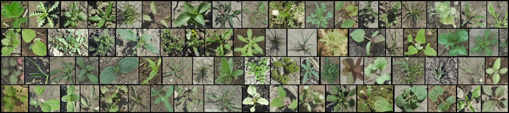
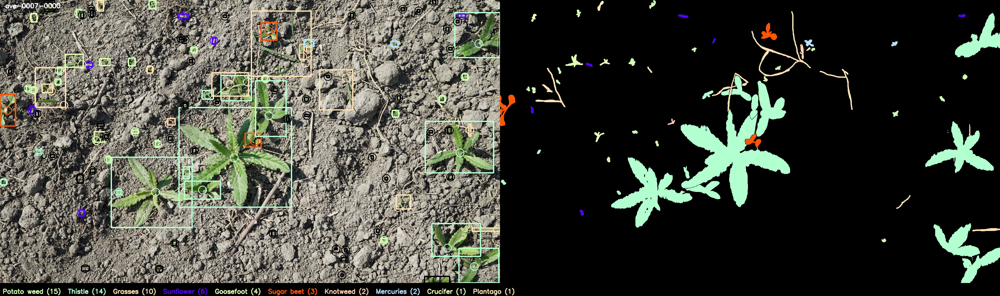

# The CropAndWeed Dataset

This repository provides utility scripts for the CropAndWeed dataset, a large-scale dataset for Precision Agriculture, consisting of highly variable real-world images and multi-modal annotations for a rich set of crop and weed categories. 
A thorough description can be found in the corresponding paper and supplementary material, which will be published at WACV 2023.


## Annotation Format
The annotations consist of multiple directories for each dataset variant in the following formats:
* `bboxes` contains csv-files for each image with object instances defined as: `Left, Top, Right, Bottom, Label ID, Stem X, Stem Y`
* `labelIds` contains semantic masks for each image
* `params` contains the following additional parameters for each image:
  * `moisture`: 0 (dry), 1 (medium) or 2 (wet)
  * `soil`: 0 (fine), 1 (medium) or 2 (coarse)
  * `lighting`: 0 (sunny) or 1 (diffuse)
  * `separability`: 0 (easy), 1 (medium), 2 (hard)

The corresponding label IDs for each datset variant are specified in [datasets.py](cnw/utilities/datasets.py). 
The names of all image and annotation files are prefixed either with _ave_ or _vwg_ refering to the Application and Experimental Sets, respectively, as described in the paper. 
The following 4-digit numbers specify the recording session, while the last 4 digits are the image id.  


## Setup
Run [setup.py](cnw/setup.py) to download and extract all dataset images and annotations. By default, the script creates mapped annotations for all pre-defined dataset variants.


## Dataset Variants
To create a specific dataset variant, use [map_dataset.py](cnw/map_dataset.py) to map the label IDs of one label specification to another. 
For instance, the command `map_dataset.py --dataset_target CropsOrWeed9` will create new directories for bboxes and labelIds with annotations mapped to the predefined variant _CropsOrWeed9_. 
Custom dataset variants can be added to [datasets.py](cnw/utilities/datasets.py) and used analogously.  

Bounding boxes are created as two distinct sets for training and evaluation purposes with the latter including a fallback _Vegetation_ class containing tiny instances as well as excluded and ambiguous species. 
Mapped semantic masks include an additional background class and are only stored if they contain any mapped species.


## Visualization
Use [visualize_annotations.py](cnw/visualize_annotations.py) to create a combined visualization for bounding boxes, stem positions and semantic masks for each annotated image. 
The dataset variant to be visualized and a filter for included images can be specified as parameters. 
For instance the command `visualize_annotations.py --dataset CropsOrWeed9 --filter vwg-0328` will create visualizations for all images of the _CropsOrWeed9_ variant containing the relevant classes and matching the recording session _vwg-0328_.
Bounding boxes and masks use the defined colors for each label from [datasets.py](cnw/utilities/datasets.py), the fallback _Vegetation_ class is included in black color. 
The assigned colors and numbers of occurences for each class are provided below each image.




## Licence
The CropAndWeed dataset is released to academic and non-academic entities for non-commercial purposes such as academic research, teaching, scientific publications or personal experimentation ([LICENCE](LICENCE)).


## Citing
If you use the CropAndWeed dataset for your research, please use the following BibTeX entry:

```BibTeX
@InProceedings{Steininger2023CropAndWeedDataset,
    author    = {Steininger, Daniel and Trondl, Andreas and Croonen, Gerardus and Simon, Julia and Widhalm, Verena},
    title     = {The CropAndWeed Dataset: a Multi-Modal Learning Approach for Efficient Crop and Weed Manipulation},
    booktitle = {Proceedings of the IEEE/CVF Winter Conference on Applications of Computer Vision (WACV)},
    month     = {January},
    year      = {2023},
    pages     = {tbd-tbd}
}
```
